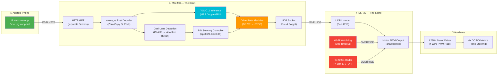

<h1 align="center">🚗 Zenity ROV</h1>

<p align="center">
  <strong>A Production-Grade, Vision-Based Autonomous Vehicle<br/>with Hardware-Level Failsafes and Real-Time AI Perception</strong>
</p>

<p align="center">
  
  
  
  
  
  
</p>

<p align="center">
  
  
</p>

---

> **Author's Note:** Zenity ROV is a solo-built autonomous vehicle that fuses custom-trained deep learning with real-time embedded control. Every line of Python AI code, every C++ failsafe, and every motor wire has been designed, written, and soldered by a single engineer. This README documents the full system — from neural network to wheel motor.

---

## 📑 Table of Contents

- [The Concept](#-the-concept)
- [System Architecture](#-system-architecture)
- [Hardware — The Physical Build](#-hardware--the-physical-build)
  - [Bill of Materials](#bill-of-materials)
  - [Wiring Guide — The L298N 4-Wire PWM Hack](#wiring-guide--the-l298n-4-wire-pwm-hack)
  - [Wiring Reference Table](#wiring-reference-table)
- [Software Architecture — The Brain](#-software-architecture--the-brain)
  - [AI Perception Pipeline](#ai-perception-pipeline)
  - [Drive Control System](#drive-control-system)
  - [Communication Protocol](#communication-protocol)
- [Safety & Failsafe System](#-safety--failsafe-system)
  - [Master Override Hierarchy](#master-override-hierarchy)
- [Project Structure](#-project-structure)
- [Installation](#-installation)
  - [Python (Mac AI Brain)](#1-python-mac-ai-brain)
  - [Arduino IDE (ESP32 Spine)](#2-arduino-ide-esp32-spine)
- [How to Run](#-how-to-run)
- [Technical Deep Dives](#-technical-deep-dives)
- [Roadmap](#-roadmap)

---

## 🔭 The Concept

Most hobbyist robot cars are remote-controlled toys wearing an "autonomous" label. Zenity ROV is different. It is a **genuine ADAS (Advanced Driver Assistance System) prototype** that processes live camera feeds through a custom-trained neural network, detects traffic signs, pedestrians, and lanes in real time, and calculates differential steering commands — all while an independent microcontroller stands guard with hardware-level failsafes that **cannot be overridden by software bugs**.

The core design principle is **Brain/Spine separation**:

| Concept | Analogy | Implementation |
|---|---|---|
| **Brain** | Cerebral Cortex — thinks, plans, decides | Mac M3 running Python + YOLO11 + OpenCV |
| **Spine** | Spinal Cord — reflexes, safety, execution | ESP32 running C++ real-time control loop |
| **Nervous System** | Neural pathways — fast, fire-and-forget | UDP unicast packets over Wi-Fi hotspot |

If the Brain crashes, freezes, or loses connection — the Spine **independently** stops the car. This is not a software flag. It is a hardware-enforced watchdog timer running on a completely separate processor.

---

## 🏗 System Architecture

The following diagram illustrates the complete data flow from camera sensor to wheel motor:



---

## 🔩 Hardware — The Physical Build

### Bill of Materials

| # | Component | Specification | Role |
|---|---|---|---|
| 1 | **ESP32** | 30-pin DevKit v1 | Real-time motor control + failsafes |
| 2 | **L298N** | Dual H-Bridge Motor Driver | Drives 4 DC motors via PWM |
| 3 | **DC Motors** | 4× Yellow BO Motors (3-6V) | Differential (tank) drive |
| 4 | **Battery** | 7.4V (2× 18650 Li-Ion in series) | Main power supply |
| 5 | **HC-SR04** | Ultrasonic Distance Sensor | Hardware emergency brake |
| 6 | **LED** | Blue, 3mm | Collision warning indicator |
| 7 | **Phone** | Android w/ IP Webcam app | Onboard camera sensor |
| 8 | **Chassis** | 4WD robot car kit | Mechanical platform |

### Wiring Guide — The L298N 4-Wire PWM Hack

> [!IMPORTANT]
> **This is not the standard L298N wiring.** The conventional approach uses `IN1`/`IN2` for direction (HIGH/LOW) and `ENA` for speed (PWM). Zenity uses a **simplified 4-wire method** that eliminates the direction pins entirely.

#### How It Works

1.  **ENA and ENB jumpers are LEFT ON.** This pulls both enable pins to 5V permanently — the H-bridge is *always* enabled.
2.  **Speed AND direction are controlled by writing PWM directly to IN1, IN2, IN3, IN4.**
    -   To drive **Motor A forward**: `analogWrite(IN1, speed)` + `analogWrite(IN2, 0)`
    -   To drive **Motor A reverse**: `analogWrite(IN1, 0)` + `analogWrite(IN2, speed)`
    -   To **stop**: `analogWrite(IN1, 0)` + `analogWrite(IN2, 0)`
3.  This reduces the required GPIO pins from 6 to 4, and simplifies the ESP32 code to a single `analogWrite()` call per motor group.

#### Why This Works

The L298N's internal logic gate responds to the *voltage level* on IN pins. When ENA is HIGH (jumper on), the output to the motor is determined entirely by IN1 and IN2. By sending a *PWM signal* instead of a static HIGH/LOW, the motor receives a proportional average voltage — giving smooth, variable speed control.

### Wiring Reference Table

```
┌─────────────────────────────────────────────────────────────────┐
│                    ZENITY ROV — WIRING MAP                      │
├──────────────────┬──────────────────┬───────────────────────────┤
│    ESP32 Pin     │   Connects To    │          Purpose          │
├──────────────────┼──────────────────┼───────────────────────────┤
│     GPIO 14      │    L298N IN1     │  Left motors  (Forward)   │
│     GPIO 27      │    L298N IN2     │  Left motors  (Reverse)   │
│     GPIO 26      │    L298N IN3     │  Right motors (Forward)   │
│     GPIO 25      │    L298N IN4     │  Right motors (Reverse)   │
│     GPIO 18      │   HC-SR04 TRIG   │  Ultrasonic trigger       │
│     GPIO 19      │   HC-SR04 ECHO   │  Ultrasonic echo          │
│     GPIO 2       │   Blue LED (+)   │  Collision warning LED    │
│      GND         │   Common GND     │  ESP32 + L298N + HC-SR04  │
├──────────────────┼──────────────────┼───────────────────────────┤
│                  │   L298N POWER    │                           │
├──────────────────┼──────────────────┼───────────────────────────┤
│   Battery 7.4V+  │  L298N +12V IN   │  Motor power supply       │
│   Battery GND    │  L298N GND       │  Shared ground rail       │
│     ─            │  L298N 5V OUT    │  ESP32 VIN (regulated)    │
│     ─            │  ENA Jumper: ON  │  Left channel always ON   │
│     ─            │  ENB Jumper: ON  │  Right channel always ON  │
├──────────────────┼──────────────────┼───────────────────────────┤
│                  │   MOTOR WIRING   │                           │
├──────────────────┼──────────────────┼───────────────────────────┤
│     ─            │  OUT1 / OUT2     │  2× Left BO motors (‖)   │
│     ─            │  OUT3 / OUT4     │  2× Right BO motors (‖)  │
└──────────────────┴──────────────────┴───────────────────────────┘
```

> [!CAUTION]
> **Common Ground is mandatory.** The ESP32 GND, L298N GND, HC-SR04 GND, and the battery negative terminal **must all share the same ground rail.** Failure to do this will cause erratic motor behavior, phantom ultrasonic readings, and random ESP32 resets.

#### Motor Wiring — Parallel Configuration (Tank Drive)

```
        ┌──────────────┐
        │    L298N     │
        │              │
  OUT1 ─┤              ├─ OUT3
  OUT2 ─┤              ├─ OUT4
        └──────────────┘
          │        │            │        │
     ┌────┘  ┌─────┘       ┌───┘  ┌─────┘
     ▼       ▼              ▼      ▼
  ┌──────┐ ┌──────┐    ┌──────┐ ┌──────┐
  │ M_FL │ │ M_RL │    │ M_FR │ │ M_RR │
  │(par.)│ │(par.)│    │(par.)│ │(par.)│
  └──────┘ └──────┘    └──────┘ └──────┘
     LEFT SIDE              RIGHT SIDE
```

The two left motors are wired **in parallel** to OUT1/OUT2, and the two right motors are wired **in parallel** to OUT3/OUT4. This creates **tank-style differential steering** — to turn left, the right side spins faster; to turn right, the left side spins faster.

---

## 🧠 Software Architecture — The Brain

The Brain runs on **macOS (Apple Silicon M3)** and is responsible for all perception, planning, and command generation.

### AI Perception Pipeline

The AI engine (`ai_engine5.py` — current production version) runs a **dual-pipeline** on every camera frame:

```
┌─────────────────────────────────────────────────────────────────┐
│                    FRAME PROCESSING PIPELINE                     │
│                                                                  │
│  ┌──────────────┐    ┌────────────────────────────────────────┐  │
│  │  /shot.jpg   │───▶│  kornia_rs Rust Decoder (Zero-Copy)   │  │
│  │  HTTP Pull   │    │  DLPack → RGB → BGR (cv2)             │  │
│  └──────────────┘    └───────────────┬────────────────────────┘  │
│                                      │                           │
│                          ┌───────────┴───────────┐               │
│                          ▼                       ▼               │
│              ┌──────────────────┐    ┌────────────────────────┐  │
│              │  PIPELINE 1:     │    │  PIPELINE 2:           │  │
│              │  YOLO11 Object   │    │  Dual-Lane Detection   │  │
│              │  Detection       │    │                        │  │
│              │                  │    │  1. ROI (bottom 50%)   │  │
│              │  • Person        │    │  2. Grayscale + CLAHE  │  │
│              │  • Stop Sign     │    │  3. Gaussian Blur      │  │
│              │  • Traffic Light │    │  4. Adaptive Threshold │  │
│              │  • 30 Speed      │    │  5. Split L/R halves   │  │
│              │  • 40 Speed      │    │  6. Contour centroids  │  │
│              │  • Parking       │    │  7. PID steering calc  │  │
│              └────────┬─────────┘    └───────────┬────────────┘  │
│                       │                          │               │
│                       ▼                          ▼               │
│              ┌────────────────────────────────────────────────┐  │
│              │          DRIVE STATE MACHINE                    │  │
│              │   stop_detected? → STOP (hold 3s) → DRIVE     │  │
│              │   steering_angle → Tank PWM conversion         │  │
│              │   Output: "left_pwm, right_pwm\n" via UDP      │  │
│              └────────────────────────────────────────────────┘  │
└─────────────────────────────────────────────────────────────────┘
```

#### Custom YOLO11 Model — `zenity_master.pt`

The AI model is **not** a generic pretrained YOLO checkpoint. It is a custom fine-tuned YOLO11 model trained on a purpose-built dataset to detect:

| Class | Action at ≥ 4% Screen Area |
|---|---|
| **Person** | Emergency stop — `BRAKING — PERSON IN PATH` |
| **Stop Sign** | Full brake — `BRAKING — STOP SIGN` |
| **Traffic Light** | HSV color classification → RED = stop, GREEN = go |
| **30 Speed** | Speed limit enforced — `LIMIT: 30` |
| **40 Speed** | Speed limit enforced — `LIMIT: 40` |
| **Parking** | Auto-park initiated |

**Distance estimation** uses bounding-box area ratio (`box_area / frame_area`). Objects are tracked as "ahead" until they occupy ≥ 4% of the frame, at which point the action is triggered. This prevents premature braking from distant detections.

**Stop-sign debouncing** requires 3 consecutive positive frames before declaring a stop — eliminating flickering brake commands from intermittent detections.

#### Traffic Light Classifier

Traffic lights receive special treatment beyond YOLO detection. The bounding box is sliced into vertical thirds, converted to HSV, and red/green pixel counts are compared:

- **Top third** → Red mask (HSV hue ranges: 0–10 and 160–180)
- **Bottom third** → Green mask (HSV hue range: 40–90)
- Whichever region has more saturated pixels determines the light state.

### Drive Control System

The steering pipeline converts raw lane positions into differential motor speeds:

1.  **PID Controller** (`kp=0.20`, `ki=0.00`, `kd=0.05`, max ±35°) — converts pixel error into a steering angle with anti-windup clamping.
2.  **Tank Mapping** — steering angle is normalized to `[-1, 1]`, then applied as:
    ```
    left_pwm  = BASE_SPEED × (1 + t)
    right_pwm = BASE_SPEED × (1 - t)
    ```
    Where `BASE_SPEED = 180` (of 255).
3.  **State Machine** — `DRIVE ↔ STOP` transitions with a 3-second brake hold before auto-resume.

### Communication Protocol

| Layer | Protocol | Details |
|---|---|---|
| Camera → Mac | HTTP GET | `/shot.jpg` endpoint, `requests.Session` with keep-alive |
| Mac → ESP32 | UDP Unicast | Port `4210`, payload: `"L,R\n"` (e.g., `"180,150\n"`) |
| Heartbeat | UDP Unicast | `"PING\n"` at 2 Hz — ESP32 watchdog triggers on silence |
| Frame Decode | kornia_rs | Rust-native JPEG decoder, DLPack zero-copy to NumPy |

> [!NOTE]
> **Why UDP instead of HTTP/TCP?** UDP is fire-and-forget — no handshake, no ACK, no retransmission. For motor commands that expire in 100ms, retransmitting a stale command is worse than dropping it entirely. A lost packet simply means the car holds its previous heading for one additional cycle.

---

## 🛡 Safety & Failsafe System

Safety is not a software feature — it is a **hardware-enforced guarantee** running on its own independent processor.

### Master Override Hierarchy

The ESP32's real-time loop enforces a strict priority chain. Higher-priority overrides **cannot** be bypassed by the Mac AI under any circumstance:

```
┌─────────────────────────────────────────────────────────────┐
│                  OVERRIDE PRIORITY (Highest → Lowest)        │
│                                                              │
│  ┌────────────────────────────────────────────────────────┐  │
│  │  🔴  PRIORITY 1 — HARDWARE RADAR BRAKE                │  │
│  │                                                        │  │
│  │  IF ultrasonic distance < 5 cm:                        │  │
│  │    → IMMEDIATE motor shutdown (all PWM = 0)            │  │
│  │    → Blue LED ON (flashing collision warning)          │  │
│  │    → ALL Mac forward commands IGNORED                  │  │
│  │    → Reverse commands still accepted (retreat)         │  │
│  │                                                        │  │
│  │  This runs in the ESP32's main loop at ~1kHz.          │  │
│  │  It does NOT wait for Wi-Fi or the Mac.                │  │
│  └────────────────────────────────────────────────────────┘  │
│                                                              │
│  ┌────────────────────────────────────────────────────────┐  │
│  │  🟡  PRIORITY 2 — WI-FI WATCHDOG                      │  │
│  │                                                        │  │
│  │  IF no UDP packet received for > 10 seconds:           │  │
│  │    → Assume Mac has crashed or lost connection          │  │
│  │    → FULL STOP (all PWM = 0)                           │  │
│  │    → Hold until packets resume                         │  │
│  │                                                        │  │
│  │  The Mac sends "PING\n" at 2 Hz as a heartbeat.        │  │
│  │  Even if no drive commands are needed, the heartbeat   │  │
│  │  proves the Brain is alive.                            │  │
│  └────────────────────────────────────────────────────────┘  │
│                                                              │
│  ┌────────────────────────────────────────────────────────┐  │
│  │  🟢  PRIORITY 3 — MAC AI COMMANDS                      │  │
│  │                                                        │  │
│  │  Normal operation — AI sends "L,R\n" PWM values.       │  │
│  │  Only executed if Priority 1 and 2 are clear.          │  │
│  └────────────────────────────────────────────────────────┘  │
│                                                              │
│  ┌────────────────────────────────────────────────────────┐  │
│  │  🔵  AUTO-RESUME — MEMORY RECOVERY                     │  │
│  │                                                        │  │
│  │  When the Priority 1 blockage (< 5cm) is removed:      │  │
│  │    → ESP32 remembers the LAST valid Mac command         │  │
│  │    → Automatically resumes driving at that speed        │  │
│  │    → Blue LED OFF                                      │  │
│  │    → No Mac intervention required                      │  │
│  └────────────────────────────────────────────────────────┘  │
└─────────────────────────────────────────────────────────────┘
```

#### Why This Design Matters

In a single-processor system (e.g., Raspberry Pi doing both AI and motor control), a Python crash means instant loss of control — the car drives off a table at full speed. In Zenity's architecture:

- If **Python crashes** → Watchdog kills motors in ≤10 seconds.
- If **Wi-Fi drops** → Same watchdog behavior.
- If a **physical object appears** in front of the car → ESP32 stops the car in **microseconds**, regardless of what the Mac is doing.
- If the **blockage is removed** → The car resumes **without** needing the Mac to re-issue a command.

---

## 📂 Project Structure

```
zenity_rov/
├── main_rov4.py          # 🎯 Production entry point — "The Nervous System"
│                         #    Camera thread, UDP comms, heartbeat, state machine, HUD
│
├── ai_engine5.py         # 🧠 Production AI engine — "The Brain" (v3.0 Single-Model)
│                         #    ZenityBrain class: YOLO11 + Lane Detection + PID
│
├── ai_engine4.py         # 🧠 Previous AI engine (v2.0) — dual-model architecture
├── ai_engine3.py         # 📦 Archived — YOLO11 Nano speed-optimized variant
├── ai_engine2.py         # 📦 Archived — first multi-class YOLO + dual-lane
├── ai_engine.py          # 📦 Archived — first production engine with distance estimation
│
├── ai_brain3.py          # 🔬 Early prototype — session-based camera + FPS counter
├── ai_brain2.py          # 🔬 Early prototype — /shot.jpg single-frame pull
├── ai_brain.py           # 🔬 Early prototype — MJPEG stream parser
│
├── main_rov.py           # 📦 Archived — v1.0 entry point (HTTP-based motor control)
│
├── test/
│   ├── test_udp.py       # 🧪 Interactive UDP transmitter for motor testing
│   ├── test_vision.py    # 🧪 kornia_rs camera feed validation
│   └── test_ocr.py       # 🧪 EasyOCR speed-sign reading experiment
│
├── zenity_master.pt      # 🤖 Custom fine-tuned YOLO11 model (gitignored)
├── venv/                 # 🐍 Python virtual environment
└── .gitignore
```

> [!TIP]
> The numbered file versions (`ai_engine.py` → `ai_engine5.py`) represent the project's iterative engineering history — from simple MJPEG parsing to a production-grade dual-pipeline AI system. The current production files are **`main_rov4.py`** and **`ai_engine5.py`**.

---

## ⚙️ Installation

### 1. Python (Mac AI Brain)

**Prerequisites:** macOS with Apple Silicon (M1/M2/M3/M4), Python 3.10+

```bash
# Clone the repository
git clone https://github.com/<your-username>/zenity_rov.git
cd zenity_rov

# Create and activate virtual environment
python3 -m venv venv
source venv/bin/activate

# Install core dependencies
pip install ultralytics         # YOLO11 framework (includes PyTorch for MPS)
pip install opencv-python       # Computer vision (cv2)
pip install numpy               # Array operations
pip install requests            # HTTP camera pull

# Install high-performance decoder (recommended)
pip install kornia-rs            # Rust-native JPEG decoder — ~2x faster than cv2.imdecode
```

> [!NOTE]
> `kornia_rs` is **optional** but strongly recommended. The system automatically falls back to `cv2.imdecode` if kornia is not installed (see `main_rov4.py` lines 45–51). On Apple Silicon, kornia_rs provides ~2x faster JPEG decoding through its Rust backend.

**Model file:** Place your `zenity_master.pt` (or any YOLO `.pt` checkpoint) in the project root. This file is gitignored due to its size.

### 2. Arduino IDE (ESP32 Spine)

**Prerequisites:** Arduino IDE 2.x

1. **Install ESP32 Board Support:**
   - Open Arduino IDE → **Settings** → **Additional Board Manager URLs**
   - Add: `https://raw.githubusercontent.com/espressif/arduino-esp32/gh-pages/package_esp32_index.json`
   - Go to **Board Manager** → Search `esp32` → Install **"ESP32 by Espressif Systems"**

2. **Select Board:**
   - Tools → Board → **ESP32 Dev Module**
   - Tools → Upload Speed → **921600**
   - Tools → Port → *(your ESP32's serial port)*

3. **Required Libraries:**
   - `WiFi.h` — built-in with ESP32 board package
   - `WiFiUdp.h` — built-in with ESP32 board package
   - No external library dependencies required.

4. **Flash the firmware:**
   - Open your ESP32 `.ino` sketch
   - Update Wi-Fi credentials (`SSID` and `PASSWORD`) to your mobile hotspot
   - Update the **static IP** or let DHCP assign one (note the IP for Python config)
   - Upload to ESP32

---

## 🚀 How to Run

Follow this exact sequence — order matters:

### Step 1: Create the Network

1. Enable your **phone's mobile hotspot** (this is the dedicated network — do NOT use home Wi-Fi for low latency).
2. Connect **both** the Mac and the ESP32 to this hotspot.
3. Note the ESP32's IP address from the Arduino Serial Monitor.

### Step 2: Start the Camera

1. Open **IP Webcam** app on the Android phone mounted on the chassis.
2. Start the server — note the IP and port (default: `http://<PHONE_IP>:8080`).
3. Verify the feed is live by visiting `http://<PHONE_IP>:8080/shot.jpg` in a browser.

### Step 3: Flash & Power the ESP32

1. Flash the ESP32 with the rover firmware (if not already done).
2. Power the car via the 7.4V battery pack.
3. Confirm in Serial Monitor: Wi-Fi connected, UDP listener started on port `4210`.

### Step 4: Configure & Launch the AI Brain

```bash
# Activate the virtual environment
source venv/bin/activate

# Edit the IP addresses in main_rov4.py (lines 60-62):
#   PHONE_IP  = "192.168.x.x"    ← Your phone's IP on the hotspot
#   ESP32_IP  = "192.168.x.x"    ← Your ESP32's IP on the hotspot

# Launch the AI engine
python main_rov4.py
```

### Step 5: Verify

You should see:
```
============================================================
  ZENITY ROV  |  v2.0  |  Initialising…
============================================================
[ZenityBrain] Loading zenity_master.pt …
[ZenityBrain] Model pinned to → MPS
[ZenityBrain] Warm-up pass …
[ZenityBrain] Ready ✓
[main] Camera + heartbeat threads started. Waiting for first frame…
[✅ DRIVE]  L:180  R:180  steer:+0.0°  AI:12.3ms
```

A **dashboard window** will open showing the annotated camera feed with bounding boxes, lane markers, and the HUD overlay. Press **`q`** to gracefully shut down (sends `0,0` stop command to ESP32 before exiting).

### Quick Test (Without AI)

To test just the motor/UDP connection without running the full AI pipeline:

```bash
python test/test_udp.py
# Type: 180,180   → Car drives forward
# Type: 200,0     → Sharp right turn
# Type: 0,0       → Stop
# Type: PING      → Heartbeat keepalive
```

---

## 🔬 Technical Deep Dives

<details>
<summary><strong>Why kornia_rs instead of cv2.imdecode?</strong></summary>

OpenCV's `imdecode` is written in C++ and works well, but `kornia_rs` is a **Rust-native** JPEG decoder that uses the DLPack protocol for zero-copy tensor sharing. On Apple Silicon, this eliminates an entire memory copy step — the decoded image tensor can be passed directly to PyTorch's MPS backend without intermediate NumPy allocation. In benchmarks on M3, kornia_rs decodes `/shot.jpg` frames ~2× faster than cv2.imdecode for the same JPEG payload.

</details>

<details>
<summary><strong>Why UDP instead of HTTP for motor commands?</strong></summary>

The original prototype (`main_rov.py`) used HTTP GET requests to the ESP32 (commenting reveals: `esp_session.get(f"http://{ESP32_IP}/drive?left={left_pwm}&right={right_pwm}")`). This was replaced with UDP for three critical reasons:

1. **Latency:** HTTP requires a TCP handshake (SYN → SYN-ACK → ACK) on every request. UDP is a single datagram — no connection setup.
2. **Stale data:** TCP guarantees delivery, meaning a congested packet queue delivers commands from 500ms ago. For motor control, stale data is *worse* than no data.
3. **Non-blocking:** The UDP socket is set to `setblocking(False)`. Fire and forget — the AI loop never pauses for network acknowledgment.

</details>

<details>
<summary><strong>How does the Lane Detection work?</strong></summary>

The lane detector uses a classical CV pipeline (no ML) on the **bottom 50%** of the frame:

1. **ROI crop** — ignore the sky, focus on the road surface
2. **CLAHE** (Contrast-Limited Adaptive Histogram Equalization) — normalizes lighting across shadows and glare
3. **Gaussian blur** (7×7) — suppress sensor noise
4. **Adaptive threshold** (Gaussian, inverted) — binarize lane markings
5. **Split left/right halves** — isolate left and right lane boundaries
6. **Contour analysis** — find largest contour in each half, compute centroid via image moments
7. **Steering target** — midpoint of left and right centroids (or dead-reckoned if only one is visible)
8. **PID correction** — pixel error from frame center → smooth steering angle

</details>

<details>
<summary><strong>What happens during "Total Lane Loss"?</strong></summary>

If both lane centroids are `None` (no valid contours found in either half), the PID integrator is **reset** to zero (preventing integral windup) and `steering_angle` returns `None`. The state machine in `main_rov4.py` handles this by commanding `(BASE_SPEED, BASE_SPEED)` — i.e., drive straight and hope to re-acquire the lane on the next frame. The car never stops due to lane loss alone; only YOLO-detected hazards or the ultrasonic sensor can trigger a stop.

</details>

---

## 🗺 Roadmap

| Phase | Milestone | Status |
|---|---|---|
| ✅ **v0.1** | MJPEG stream parsing + YOLO11 Nano inference on MPS | Complete |
| ✅ **v0.2** | `/shot.jpg` pull + kornia_rs zero-copy decode | Complete |
| ✅ **v0.3** | Dual-lane detection + PID steering controller | Complete |
| ✅ **v1.0** | UDP motor control + ESP32 integration | Complete |
| ✅ **v2.0** | Multi-class YOLO (Person, Car, Light, Stop) + State Machine + HUD | Complete |
| ✅ **v3.0** | Custom fine-tuned `zenity_master.pt` (Stop, 30, 40, Parking, Person) | Complete |
| ✅ **Safety** | ESP32 watchdog + HC-SR04 radar brake + auto-resume | Complete |
| 🔄 **Next** | Speed zone enforcement (dynamic `BASE_SPEED` from 30/40 detections) | In Progress |
| 📋 **Planned** | Auto-parking routine (from Parking sign detection) | Upcoming |
| 📋 **Planned** | ROS 2 migration for sensor fusion and path planning | Future |

---

<p align="center">
  <strong>Designed, Engineered & Wired Solo by Jaydeep Ahir.</strong><br/>
  <em>Zenity ROV — where neural networks meet real wheels.</em>
</p>

<p align="center">
  <sub>© 2025–2026 Jaydeep Ahir. Built with 🧠 and a soldering iron.</sub>
</p>
